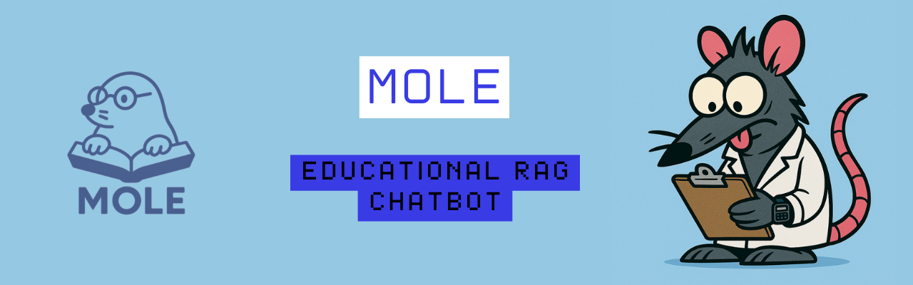

# 🧠 Mole — RAG-Powered Chatbot for Educational Documents

> *“Because knowledge shouldn't hide underground.”*

---

<p align="center">
  
</p>

**Mole** is a bilingual, educational chatbot powered by **RAG (Retrieval-Augmented Generation)**.  
Feed it your documents, ask questions, and get answers as if a small academic rodent had just read them with laser focus.

Mole was created by [Deeprat](https://github.com/DeepRatAI) to make document-based learning more accessible, especially for students, curious minds, and caffeine-powered autodidacts.

---

## 🎯 What Can Mole Do?

- Loads documents (`.pdf`, `.docx`) and chunks them smartly.
- Uses `sentence-transformers` to build semantic embeddings.
- Indexes everything with FAISS for efficient retrieval.
- Sends context + query into a HuggingFace LLM to generate responses.
- Supports different answering **modes** (detailed below).
- Can generate a **summary** of all documents.
- Detects and replies in **Spanish or English**, depending on input.
- Runs in local Jupyter or Google Colab via `gradio` interface.

---

## 🧠 Answer Modes

Mole supports two response styles, selectable in the UI:

- `Insightful`: Extended, explanatory answers — good for understanding concepts.
- `Expert`: Short, direct, technical answers — perfect for efficient workflows.

---

## 📝 Summarize Feature

Mole includes a **document summarization** option:  
- Generates a general overview of the loaded content.
- Uses the same RAG architecture to create a focused summary.
- Available in both Spanish and English.

Ideal for quickly scanning large documents or prepping for deeper questions.

---

## 🌍 Bilingual Support

Mole detects and answers in **English or Spanish**.  
No need to toggle anything — just speak your language, Mole will follow.

Examples:
- `"¿Qué dice el documento sobre aprendizaje profundo?"` → Spanish response  
- `"Summarize the section on reinforcement learning."` → English response

---

## 🛠 Technologies

| Component           | Library                     |
|--------------------|-----------------------------|
| Embeddings         | `sentence-transformers`     |
| Vector Search      | `faiss-cpu`                 |
| Language Models    | `transformers`, `torch`     |
| RAG Orchestration  | `accelerate`, `peft`        |
| UI                 | `gradio`                    |
| File Loading       | `PyMuPDF`, `python-docx`    |
| Extras             | `scikit-learn`              |

---

## 🚀 How to Use

### 🧑‍💻 Local Setup

1. Clone the repo:
   ```bash
   git clone https://github.com/yourusername/mole.git
   cd mole

2. Install dependencies:

   ```bash
   pip install -r requirements.txt
   ```

3. Launch `mole_1.ipynb` in Jupyter or VS Code.

4. Run **all** notebook cells to build Mole.

5. Upload your documents via the interface.

6. Ask away. Choose your mode. Let Mole enlighten you.

---

### ☁️ Google Colab Setup

1. Upload the repo folder to your Google Drive.

2. Open `mole_1.ipynb` in Google Colab.

3. Mount your Drive:

   ```python
   from google.colab import drive
   drive.mount('/content/drive')
   ```

4. Adjust any paths in the notebook to match your Drive location.

5. Install dependencies:

   ```python
   !pip install -r /content/drive/MyDrive/mole/requirements.txt
   ```

6. Run all cells top-to-bottom. Be patient. Mole is thinking.

7. Load your docs and interact with the Gradio interface.

---

## 📁 Project Structure

```
mole/
├── mole_1.ipynb          # Main notebook
├── requirements.txt      # Dependencies
├── logo.png              # Glorious Mole icon
```

---

## 📝 Why a Notebook?

Deeprat deliberately chose to keep Mole as a **Jupyter Notebook**, not a script, to make it more accessible:

* Better for students and beginners learning about RAG
* Easier to read, experiment with, and understand
* Transparent architecture — no black-box magic

Mole is a learning tool, not a sealed product.

---

## ⚖️ License

MIT — Clone it, modify it, share it. Just don’t pretend you're the original rodent.

---

> **Mole™** — built by Deeprat so your documents can finally talk back.

